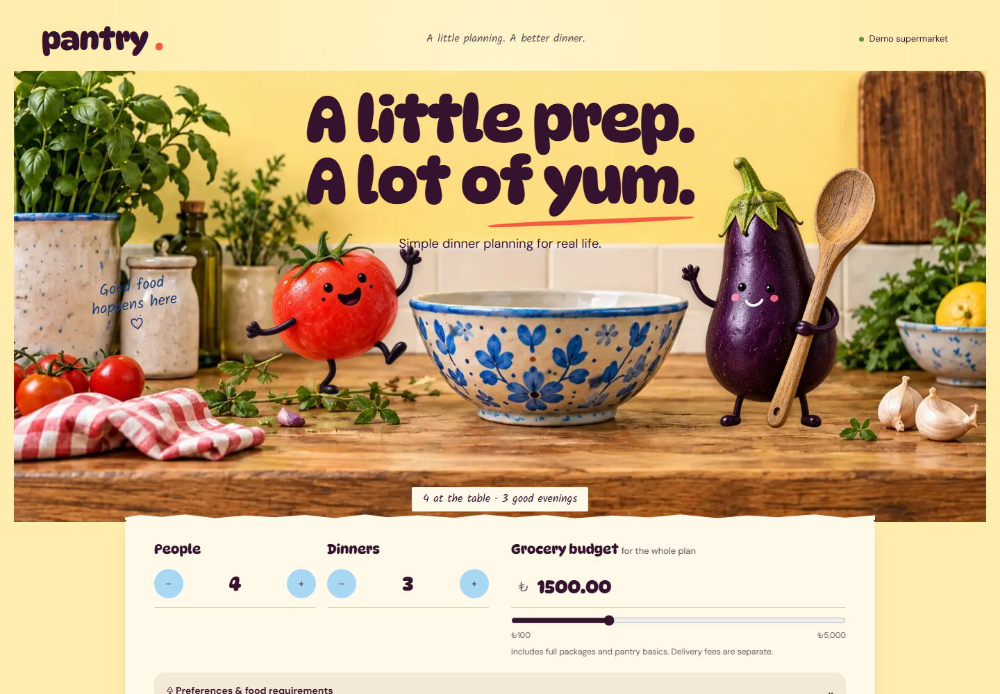

# Pantry

Dinner planning that starts with real life: how many people are eating, how much time you have, what everyone can safely eat, and what the whole grocery basket will actually cost.



Pantry builds a multi-dinner plan, combines the ingredients, maps them to supermarket products, and prices the full packages you would need to buy. Before creating a basket, you can remove anything already in your kitchen. If a product disappears or its price changes, Pantry recovers without quietly breaking the plan.

This repository is a working, provider-independent version of that product. It uses fictional retailer data, so anyone can run the complete experience without paid APIs or partner credentials.

## Take a quick tour

1. Tell Pantry how many people and dinners you are planning for.
2. Set a total grocery budget, cooking-time limit, dietary preferences, allergies, and exclusions.
3. Review a validated dinner plan with scaled recipes.
4. Check the combined basket, full-package quantities, leftovers, and total cost.
5. Untick ingredients you already have or choose another matching product.
6. Create a retry-safe demo cart and explore stock, price, and retailer-failure scenarios.

No account is required. Guest plans can be resumed in the same browser and deleted from the data page.

## Run Pantry locally

The simplest route is Docker Desktop with Compose:

```bash
cp .env.example .env
docker compose up --build
```

Then open [http://localhost:3000](http://localhost:3000). The API runs on port `8080`, and PostgreSQL runs on port `5432`.

For development without Docker, use Java 21 and Node.js 22:

```bash
cd backend
./mvnw verify

cd ../frontend
pnpm install
pnpm verify
pnpm dev
```

The backend test suite always uses PostgreSQL 17—through Testcontainers when Docker is available, or a managed local PostgreSQL binary otherwise. It never falls back to an easier in-memory database.

## What makes this more than CRUD

- Recipe ingredients and retailer products are separate domain concepts.
- Ingredient aliases are normalized across English and Turkish names.
- Required quantities are aggregated across meals before package counts are calculated.
- Pricing uses full packages and keeps leftover quantities visible.
- Allergy, diet, cooking-time, stock, and budget rules are deterministic.
- AI is allowed to propose structured recipes, but it cannot invent products, availability, or prices.
- Product recovery follows a clear path: matching SKU, reviewed ingredient substitute, then meal replacement.
- Guest ownership, CSRF protection, idempotency, optimistic locking, and expiry cleanup are built in.

## Architecture

```text
Next.js + TypeScript
        │
        │ HTTPS / JSON / CSRF / guest cookie
        ▼
Spring Boot modular monolith
  identity · ingredient · recipe · planning · retailer
        │
        ├── PostgreSQL + Flyway
        └── provider ports
              ├── AI proposal source
              └── retailer catalog/cart adapter
```

The first production shape is intentionally a modular monolith: stateless frontend and backend instances around managed PostgreSQL. Redis, Kafka, and dedicated search are documented options with adoption gates, not default complexity.

## Repository guide

- [`frontend/`](frontend/) — responsive Next.js application, component tests, and the browser journey
- [`backend/`](backend/) — Java 21 Spring Boot API, domain rules, persistence, and integration tests
- [`docs/`](docs/) — product, architecture, domain, data, security, deployment, and provider decisions
- [`.github/`](.github/) — CI, CodeQL, Dependabot, issue forms, and pull-request standards

Useful starting points:

- [Implementation status](docs/implementation-status.md)
- [Architecture](docs/architecture.md)
- [Domain model](docs/domain-model.md)
- [Product specification](docs/product-specification.md)
- [Deployment guide](docs/deployment.md)
- [Provider onboarding](docs/provider-onboarding.md)
- [Architecture decisions](docs/adr/README.md)

## Quality and security

The repository includes unit, module-boundary, API-contract, PostgreSQL integration, migration, frontend component, and Playwright end-to-end tests. GitHub Actions runs those checks, builds both containers, scans Java and TypeScript with CodeQL, and keeps dependencies visible through Dependabot.

Security-sensitive defaults fail closed: production cookies are secure, demo recovery controls are disabled, operational endpoints are denied publicly, secrets are not committed, and guest tokens are stored only as hashes.

See [SECURITY.md](SECURITY.md) for vulnerability reporting and [CONTRIBUTING.md](CONTRIBUTING.md) before opening a pull request.

## Honest boundaries

The included products, prices, availability, and cart transfer are simulations. Connecting Pantry to a real supermarket requires an authorized retailer API or partnership. Live AI, login, and production infrastructure are also adapter/deployment choices; none of them is required to evaluate the engineering in this repository.
