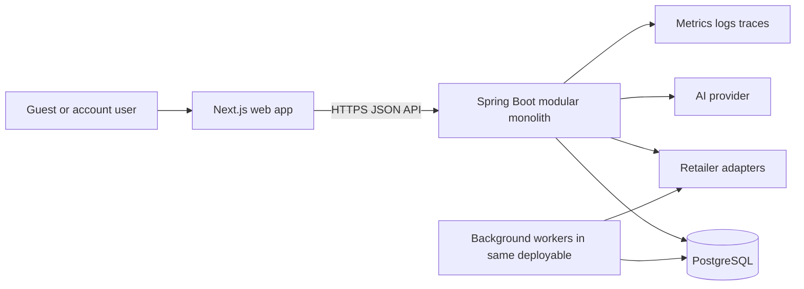

# Architecture

## System context



The browser never calls an AI or retailer provider directly. Spring Boot is the policy and orchestration boundary.

## Backend shape

Each module follows a pragmatic ports-and-adapters/clean-architecture direction:

```text
module
├── domain          pure rules, aggregates, value objects, domain events
├── application     use cases, commands, queries, ports, transactions
├── adapter
│   ├── in          web/event/job entry points
│   └── out         JPA, AI, retailer, clock, ID, and messaging adapters
└── package-info.java
```

Dependencies point inward. Domain code imports no Spring, JPA, JSON, HTTP, provider SDK, or database type. Application code may use transaction abstractions but not controller DTOs. Adapters translate at the edge.

## Modules

The implemented Modulith modules are `identity`, `ingredient`, `recipe`, `retailer`, `ai`, `planning`, and `shared`. Planning currently owns the cohesive plan/basket/pricing/matching/substitution transaction boundary. The richer target boundaries are defined in [domain-model.md](domain-model.md); split them only when their independent lifecycle or team ownership becomes real.

Spring Modulith verification and ArchUnit tests enforce:

- no cycles;
- no direct repository/entity access across modules;
- no adapter dependencies from domain/application packages;
- only documented module APIs are public. Provider fakes live behind the same ports as future production adapters.

## Runtime workflow

Planning is a persisted workflow with an asynchronous evolution seam:

The included provider-free reference slice performs these stages synchronously in one bounded request because its curated recipes and catalog are local and deterministic. The persisted snapshots, idempotency keys, state names, and module seams allow the provider-backed stages to move to Modulith events/workers without changing the browser's resource model.

1. `CreatePlanningRequest` validates input and snapshots constraints.
2. A transaction creates the plan and records `PlanRequested`.
3. A handler asks the curated planner or AI port for a typed proposal.
4. Deterministic validators resolve ingredients and enforce safety/time rules.
5. Matching aggregates demand and ranks current eligible offers.
6. Pricing performs package math and budget optimization.
7. The plan and basket become reviewable or stop with actionable reasons.

The synchronous reference path is idempotent and records state transitions. Spring Modulith's event-publication registry is available for provider-backed handlers when those calls become asynchronous; the current local path does not pretend to publish work it does not need.

## Consistency

- Aggregate changes are transactional within one PostgreSQL database.
- Cross-module reactions use events after commit.
- `@Version` protects mutable aggregates.
- Requests that can be replayed carry an idempotency key and payload fingerprint.
- External calls occur outside database transactions, with attempt state recorded before and after the call.
- Immutable snapshots/version references preserve what the user reviewed.

## Configuration

- Typed `@ConfigurationProperties`, validated at startup.
- Secrets only through environment/secret manager; never committed.
- Profiles are limited to environment wiring, not business-rule differences.
- Feature flags control provider rollout and risky integrations.
- UTC internally; locale/time zone only at presentation and explicit scheduling boundaries.

## Error model

All HTTP errors use RFC 9457 Problem Details with stable Pantry fields:

```json
{
  "type": "https://pantry.example/problems/plan-version-conflict",
  "title": "The plan changed",
  "status": 409,
  "code": "PLAN_VERSION_CONFLICT",
  "detail": "Refresh the plan before applying this change.",
  "correlationId": "..."
}
```

Provider errors are translated into domain-neutral failure types. Stack traces and provider payloads are never exposed publicly.

## Deployment topology

Initial production deployment has a stateless web frontend, one Spring Boot service that can scale horizontally, and managed PostgreSQL. Scheduled/background execution runs in the same artifact with cluster-safe locking. Static assets use a CDN. A separate worker deployment may use the same binary when workloads justify it.

## Evolution gates

- Add Redis only after measuring repeated hot reads, distributed rate-limit needs, or session/catalog pressure.
- Add Kafka only when durable cross-service streams or isolation requirements exceed Modulith events.
- Add Elasticsearch/OpenSearch only when PostgreSQL full text plus `pg_trgm` fails measured relevance/latency goals.
- Extract a service only when a stable module needs independent ownership, scaling, deployment, or isolation.
