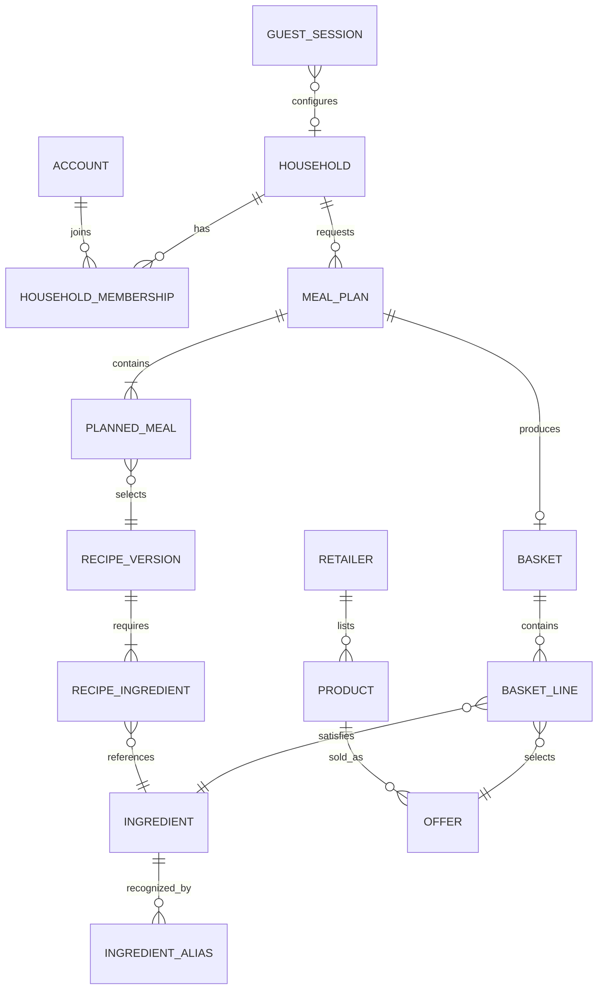
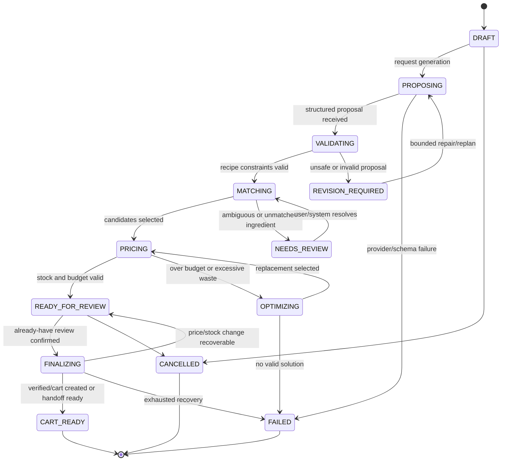

# Pantry Domain Model

Status: proposed baseline for implementation

## 1. Product invariant

Pantry turns a household's dinner constraints into a purchasable, explainable basket. A plan is not valid merely because an AI proposed appealing recipes. It is valid only after deterministic code has verified dietary safety, quantities, retailer products, package counts, current prices, stock, and budget.

The existing demo remains the product reference. The backend is introduced behind it incrementally; the frontend is not discarded.

## 2. Bounded modules

Pantry starts as a Spring Modulith modular monolith. Modules communicate through public application services, stable IDs/value objects, and domain events. A module must not read another module's JPA repositories or entities directly.

| Module | Owns | Does not own |
|---|---|---|
| `identity` | Account, authentication identity, guest-session ownership/claiming | Household food preferences |
| `household` | Household, members, planning preferences, dietary rules, allergies | Recipes or retailer data |
| `planning` | MealPlan aggregate, dinner slots, lifecycle orchestration | Recipe truth, SKU matching details |
| `recipe` | Recipe, servings, steps, recipe ingredient requirements | Retailer products and prices |
| `ingredient` | Canonical Ingredient, aliases, units, normalization/conversion | Product catalog |
| `catalog` | Retailer, Store/fulfilment context, Product/SKU, package data, offers, stock snapshots | Recipe ingredients |
| `matching` | Ingredient-to-product candidates, ranking, explanations, approvals | Canonical catalog ownership |
| `pricing` | Package math, priced line calculations, basket totals, budget evaluation | Checkout/cart mutation |
| `basket` | Basket aggregate, already-have adjustments, selected product lines, review state | Retailer-side cart |
| `retailer` | Gateway interfaces, retailer adapters, cart attempt/reconciliation records | Core planning policy |
| `substitution` | Recovery decisions and replacement workflow | Product or recipe ownership |
| `ai` | Provider calls, prompts, schemas, proposal provenance | Acceptance of plans or factual retail data |
| `analytics` | Read models/events for product learning and operational reporting | Transactional decisions |

## 3. Central concepts and relationships



Cross-module relationships use identifiers, not ORM relationships. For example, `PlannedMeal` stores a `RecipeVersionId`; it does not have a JPA `@ManyToOne` to a recipe entity.

## 4. Aggregate definitions

### Identity and household

**GuestSession** is an aggregate root with `id`, opaque public token hash, status, created/last-seen/expiry timestamps, and optional `claimedByAccountId`. The raw guest token is never stored. A guest session may own a draft household configuration, plans, and baskets via its ID. Claiming a session is an idempotent operation that transfers ownership to an authenticated account without duplicating plans.

**Account** is deliberately small: `id`, authentication subject/provider, status, and audit timestamps. Password storage should be delegated to a proven identity solution if password login is introduced.

**Household** is an aggregate root with `id`, owner reference (`GuestSessionId` or `AccountId`), locale, currency, retailer/store context, member count, and preferences. It owns:

- `HouseholdMember`: optional label plus member-specific constraints.
- `DietaryRule`: controlled rule code and severity.
- `Allergy`: canonical allergen code, severity, and cross-contamination policy.
- `PlanningPreferences`: target dinner count, maximum cook time, budget, disliked ingredients, cuisine preferences, and leftover preference.

Safety constraints are modeled as structured values, never as a single free-text field. Free text may be retained as source input but cannot be the only enforcement mechanism.

### Recipe and ingredient

**Ingredient** is a canonical food concept, separate from anything a retailer sells. It has `id`, canonical name, category, default measurement dimension, allergen tags, dietary tags, and normalization metadata.

**IngredientAlias** maps a normalized phrase plus locale to an ingredient. Examples can cover Turkish/English names, spelling variants, and retailer wording. Alias confidence and provenance are recorded; ambiguous aliases yield candidates rather than silently choosing.

**Recipe** is the stable identity and editorial container. **RecipeVersion** is immutable content used by plans and contains title, servings, preparation/cook time, instructions, dietary/allergen annotations, and `RecipeIngredient` requirements. Editing a recipe creates a new version so an accepted plan remains reproducible.

**RecipeIngredient** references a canonical `IngredientId` and specifies quantity, unit, preparation note, whether it is optional, and substitution constraints. Quantities are stored as decimal values with an explicit unit; never as presentation strings.

### Retail catalog

**Retailer** identifies a retailer and its integration capabilities. Capabilities are explicit: catalog read, live price, live stock, cart creation, cart mutation, checkout handoff.

**StoreContext** identifies the location/fulfilment context needed for truthful prices and stock, such as branch, postal area, delivery slot, or channel.

**Product** represents a retailer SKU and has retailer-scoped external ID, title, brand, category, package quantity/unit, normalization attributes, product URL/image references, and lifecycle status. It is never treated as an Ingredient.

**Offer** is time- and store-scoped commercial data for a product: price, currency, promotion details, availability, observed time, and expiry/staleness policy. Historical observations may be retained, but only sufficiently fresh offers can be used for finalization.

### Planning

**MealPlan** is the primary orchestration aggregate. It stores:

- owner and `HouseholdId`;
- an immutable `PlanningRequestSnapshot` containing dinner count, household size, budget, time limit, safety constraints, locale, currency, retailer/store context, and pantry assumptions;
- status and optimistic-lock version;
- `PlannedMeal` slots referencing immutable recipe versions;
- proposal provenance and validation results;
- current priced total and failure reasons where applicable.

`PlannedMeal` records its slot/date, recipe version, requested servings, and explanation. The plan references a proposal from AI or a deterministic planner; it does not trust that proposal.

### Basket

**Basket** is created from one validated plan and store context. It owns:

- `PantryDeclaration` entries for items/quantities the user already has;
- `BasketLine` entries that connect one canonical ingredient demand to a selected offer;
- package count, supplied quantity, required quantity, estimated leftover, unit/package price, and line total;
- unmatched/review-required items;
- price/stock verification timestamps;
- review/finalization status.

A line may satisfy aggregated demand from several meals. This is required for correct package math, reuse, and waste optimization.

### Retailer cart execution

**CartAttempt** records an idempotency key, basket version, retailer, request fingerprint, status, external cart ID/URL when available, per-line outcomes, retry metadata, and timestamps. Retries with the same key and request fingerprint return/reconcile the same outcome; a reused key with different input is rejected.

## 5. Meal-plan lifecycle



State transitions happen through named aggregate methods/application use cases, not arbitrary status setters. Each transition records a reason and emits an event after the database transaction commits. Long-running steps are resumable from persisted state.

`READY_FOR_REVIEW` means the displayed estimate is coherent, not permanently guaranteed. `FINALIZING` always refreshes or revalidates offers and stock.

## 6. Basket lifecycle

`DRAFT -> NEEDS_REVIEW -> VERIFIED -> SUBMITTING -> CREATED`

Alternative exits are `RECOVERY_REQUIRED`, `PARTIALLY_CREATED` (only if an adapter can produce this state), `FAILED`, and `CANCELLED`. A partially created external cart must never be reported as success; its reconciliation data is preserved.

Editing the already-have list or changing a product invalidates `VERIFIED` and increments the basket version. A cart attempt is bound to that exact version.

## 7. AI boundary

AI is allowed to:

- propose meal themes and recipes as typed structured output;
- suggest canonical ingredient phrases and approximate culinary quantities;
- offer explanations and bounded alternatives;
- assist alias discovery for later review.

AI is not allowed to assert or decide:

- retailer SKU identity, price, promotion, or availability;
- final allergen/dietary safety;
- package counts, monetary totals, or budget compliance;
- whether catalog data is fresh enough;
- cart creation success;
- lifecycle transitions without deterministic validation.

The AI module returns a `MealPlanProposal` DTO containing schema version, meals, servings, time estimates, ingredient requirements, and explanation. It also stores provider/model, prompt-template version, response ID/hash, latency, token usage, and parse outcome. Provider output is untrusted input.

The deterministic pipeline is:

```text
validate schema
  -> resolve ingredient names to canonical IDs
  -> verify recipe quantities/times
  -> enforce allergies and dietary rules
  -> aggregate ingredient demand
  -> subtract reviewed pantry quantities
  -> match eligible retailer offers
  -> calculate package counts and leftovers
  -> verify stock and fresh prices
  -> optimize against budget/waste/preferences
  -> produce reviewable basket
```

Allergen validation fails closed: unresolved ingredients or unknown safety metadata require review or replanning.

## 8. Core deterministic rules

### Normalization and matching

Normalize Unicode, case, punctuation, whitespace, locale-specific characters, units, brand noise, and known synonyms. Exact canonical aliases rank first. PostgreSQL `pg_trgm` similarity supplies candidates, not final truth.

Product ranking should be explainable and initially weighted by ingredient/category compatibility, package suitability, price, availability freshness, dietary compatibility, user brand preference, and expected waste. Hard safety/category mismatches are filters, not negative scores.

### Quantity and package math

All convertible quantities are normalized to a base unit by measurement dimension. For an eligible package:

```text
netRequired = max(0, aggregatedRequired - confirmedPantryQuantity)
packageCount = ceil(netRequired / packageQuantity)
supplied = packageCount * packageQuantity
leftover = supplied - netRequired
lineTotal = packageCount * currentPackagePrice
```

Discrete products and non-convertible units require explicit conversion rules or review. Floating-point arithmetic is forbidden for money and measured quantities; use `BigDecimal` and explicit rounding policies. Currency is part of every money value.

### Budget optimization

Budget is enforced against the full-package basket total. The initial implementation uses a bounded, explainable search:

1. choose the best eligible SKU per ingredient;
2. try lower-cost eligible SKUs without breaking hard constraints;
3. prefer plans that reuse opened packages and reduce waste;
4. replace a costly meal with an already validated alternative;
5. fail with an explicit shortfall if no solution fits.

Optimization must not trade away allergy/dietary safety or required meal count. Every replacement records its reason and before/after total.

### Recovery and substitution

On unavailable/stale product:

1. select another eligible SKU for the same ingredient;
2. if none, use an approved ingredient substitution and recalculate affected recipe constraints;
3. if none, replace the affected meal;
4. re-aggregate demand and fully reprice/revalidate the basket.

Recovery is bounded by attempt count and a persisted workflow state. It must not loop indefinitely or silently change a meal after user approval.

## 9. Consistency and integration policy

- Use optimistic locking on `MealPlan`, `Basket`, and mutable catalog projections.
- Database writes and domain-event publication use Spring Modulith's event publication registry/outbox-style completion tracking.
- External retailer calls never occur while holding a database transaction open.
- Store external request/response metadata with secrets and unnecessary personal data redacted.
- Every mutating public API accepts or derives an idempotency key where retries are plausible.
- Scheduled reconciliation can resume incomplete cart attempts and stale workflows.
- Kafka is deferred until measured throughput, isolation, or cross-service needs justify it.
- Redis is deferred until measured caching, distributed rate limiting, session, or hot-catalog needs justify it.

## 10. First implementation slice

Build one vertical slice without real retailer cart mutation:

1. Create a guest session and household planning request.
2. Generate or load a typed meal-plan proposal.
3. Normalize ingredients and validate constraints.
4. Match against a seeded retailer catalog in PostgreSQL using exact aliases plus `pg_trgm` candidates.
5. Calculate packages, leftovers, and totals.
6. Let the user confirm already-have quantities.
7. Recalculate and revalidate the basket.
8. Simulate a stock failure and exercise all three recovery levels.
9. Produce a checkout handoff result through a fake retailer adapter.

This slice demonstrates domain modeling, transactions, concurrency control, integration boundaries, recovery, and testing without pretending an unavailable retailer API exists.

## 11. Test obligations

- Unit tests for unit conversion, package rounding, aggregation, budget decisions, safety validation, match scoring, and substitution ordering.
- Property-style tests for invariants such as `supplied >= netRequired` and `lineTotal == count * price`.
- Aggregate transition tests that reject illegal transitions and stale versions.
- Repository/integration tests against real PostgreSQL 17, using Testcontainers with Docker or the embedded PostgreSQL binary fallback, including `pg_trgm` behavior with no skipped database suite.
- Contract tests for every retailer adapter and the fake adapter.
- Integration tests for event publication/retry and idempotent cart attempts.
- End-to-end acceptance tests for guest planning, already-have review, price change, stock failure, and session claiming.
